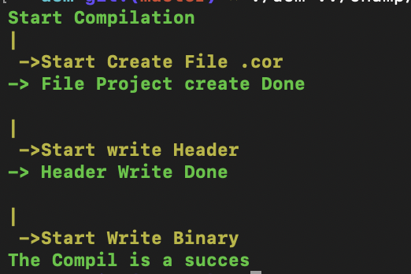
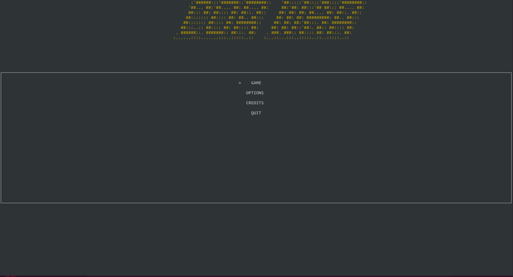
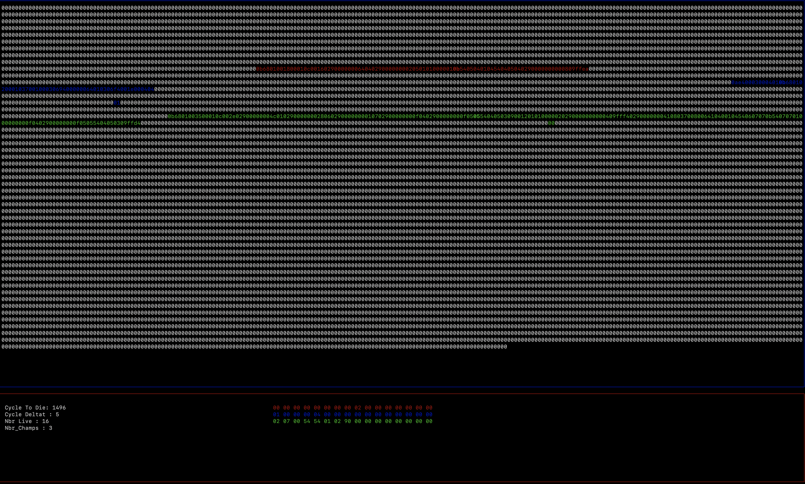

# Corewar_Epitech

## Corewar History

At the beginning of a game, each battle program is loaded into memory at a random location, after which each program executes one instruction in turn. The goal of the game is to cause the processes of opposing programs to terminate (which happens if they execute an invalid instruction), leaving the victorious program in sole possession of the machine.

The earliest published version of Redcode defined only eight instructions. The ICWS-86 standard increased the number to 10 while the ICWS-88 standard increased it to 11. The currently used ICWS-94 standard has 16 instructions. However, Redcode supports a number of different addressing modes and (from ICWS-94) instruction modifiers which increase the actual number of operations possible to 7168. The Redcode standard leaves the underlying instruction representation undefined and provides no means for programs to access it. Arithmetic operations may be done on the two address fields contained in each instruction, but the only operations supported on the instruction codes themselves are copying and comparing for equality.

## Project

we had to realize this project during our first year.
We develop this project in 1 week with team of 4.
This project is composed of two parts the **vm** and the **asm**

## Download

this project is compatible with Linux and Mac OS
`git clone https://github.com/ClementBolin/Corewar_Epitech.git`

for start **VM**:
`cd Corewar_Epitech && make && ./corewar/corewar ./champ/abel.cor ./champ/pdd.cor ./champ/bill.cor`

for start **ASM**
`cd Corewar_Epitech && make && ./asm/asm ./champ/pdd.s`

# ASM

the purpose of the asm is to transform a .s file (champion) into a binary .cor file

a .cor file is a file understandable by the *vm*.

# VM

the goal of the vma is to create an arena where the champions can compete (.cor) by calling instructions.
there can be up to 4 champions in the VM

## rule

each champion is composed of a **PC** and **16 registers**. A **PC** is: This is a special register that contains the memory address (in the virtual machine) of the next instruc- tion to be decoded and executed. It is very practical if you want to know where you are and to write things in the memory.

The machine’s role is to execute the programs that are given to it as parameters, generating processes.
It must check that each process calls the "live" instruction every CYCLE_TO_DIE cycles.
If, after NBR_LIVE executions of the instruction "live", several processes are still alive, CYCLE_TO_DIE is de- creased by CYCLE_DELTA units. This starts over until there are no live processes left.
The last champion to have said “live” wins.

## instructions

As i said before there are several kind of instruction, here they are with short description:

1. **0x01 (live)** takes 1 parameter: 4 bytes that represent the player’s number. :white_check_mark:

2. **0x02 (ld)** takes 2 parameters. It loads the value of the first parameter into the second parameter,
which must be a register (not the PC).
ld 34, r3 loads the REG_SIZE bytes starting at the address PC + 34 % IDX_MODintor3. :white_check_mark:

3. **0x03 (st)** takes 2 parameters. It stores the first parameter’s value (which is a register) into
the second (whether a register or a number). :white_check_mark:

4. **0x04 (add)** takes 3 registers as parameters. It adds the content of the first two and puts the sum
into the third one (which must be a register). :white_check_mark:

5. **0x05 (sub)** Similar to add, but performing a subtraction. :white_check_mark:

6. **0x06 (and)** takes 3 parameters. It performs a binary AND between the first two parameters
and stores the result into the third one (which must be a register). and r2, %0,r3 puts r2 & 0 into r3. :white_check_mark:

7. **0x07 (or)** Similar to and, but performing a binary OR. :white_check_mark:

8. **0x08 (xor)** Similar to and, but performing a binary XOR (exclusive OR). :white_check_mark:

9. **0x09 (zjmp)** takes 1 parameter, which must be an index. It jumps to this index if the carry is worth 1.
Otherwise, it does nothing but consumes the same time. :x:

10. **0x0a (ldi)** takes 3 parameters. The first two must be indexes, the third one must be a register. :white_check_mark:

11. **0x0b (sti)** takes 3 parameters. The first one must be a register. The other two can be indexes or registers. :white_check_mark:

12. **0x0c (fork)** takes 1 parameter, which must be an index. It creates a new program that inherits different statesfromtheparent. :x:

13. **0x0d (lld)** Similar to ld :white_check_mark:

14. **0x0e (lldi)** Similar to ldi :white_check_mark:

15. **0x0f (lfork)** Similar to fork :x:

16. **0x10 (aff)** takes 1 parameter, which must be a register. It displays on the standard output the character whose ASCII code 
is the content of the register (in base 10). :white_check_mark:

# TEAM

### Richard Habimana

[Github](https://github.com/Richard-DEPIERRE)

---

### Matisse Page

[Github](https://github.com/matissepage)

---

### Loic Warisse

[Github](https://github.com/WarisseLoic)

---

### Clement Bolin

[Github](https://github.com/ClementBolin)